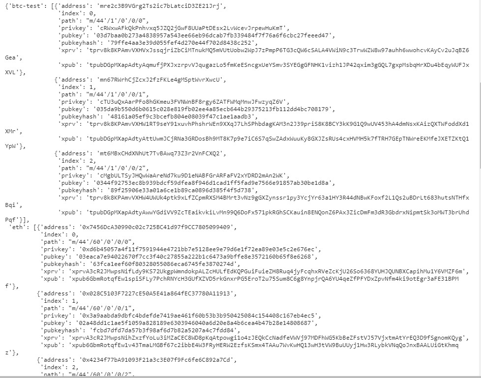

# Unit 19 Homework - Blockchain with Python

The objective of this repository is to design a wallet that can send either testnet bitcoin or testnet ethereum crytpocurrencies to any counterpart address that meet the requirementes of the network.

In addition to that, the wallet has provisions to execute transactions with real bitcoin.

Follow steps below:

1. Clone the hd-wallet-derive tool into the wallet folder and install it

2. Open up gitbash as an administrator and perform the "./derive" function, the output will give you 3 addresses

3. Using wallets.py file, now we generate all the different addresses
    

4. Link the transaction signing libraries

5. Send an offline transaction

    

    
   
    Successful bitcoin test transaction

   

   Succesful transaction reciept
